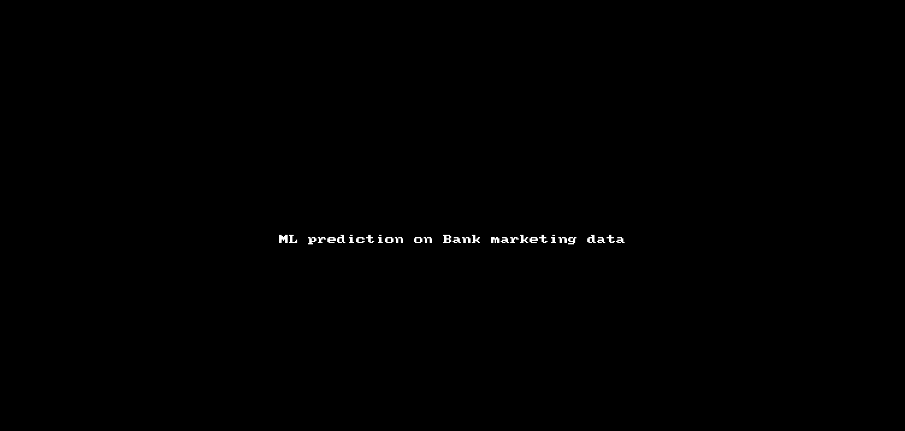

# 🏦 Bank Marketing Analysis - Machine Learning Project

[](https://quarto.org/)
[](https://www.r-project.org/)

## 📋 Description

Projet d'analyse de données et de machine learning sur les campagnes de marketing direct d'une institution bancaire portugaise. L'objectif est de prédire la souscription à un dépôt à terme en utilisant diverses techniques d'apprentissage automatique.

**Auteurs :** Pierre Jean & Karl Sondeji  
**Formation :** M1 Économie de l'entreprise - Université de Tours  
**Superviseurs :** Julie Scholler et Franck Piller  
**Date :** Mars 2023

## 🎯 Objectif

Identifier les clients les plus susceptibles de souscrire à un dépôt à terme afin d'optimiser les campagnes marketing et réduire les coûts d'investissement.



## 📊 Dataset

- **Source :** Campagnes de marketing direct bancaire portugais
- **Échantillon d'entraînement :** 45 211 observations, 17 variables
- **Échantillon de test :** 4 521 observations, 17 variables
- **Variable cible :** `y` (souscription oui/non)

### Variables principales :
- **Démographiques :** âge, emploi, statut marital, éducation
- **Bancaires :** crédit immobilier, emprunt, équilibre financier
- **Campagne :** durée d'appel, nombre de contacts, résultats précédents

## 🤖 Modèles implémentés

- **KNN** - k-Nearest Neighbors
- **LDA/QDA** - Analyse Discriminante Linéaire/Quadratique
- **SVM** - Support Vector Machine (linéaire et radial)
- **CART** - Classification and Regression Trees
- **Random Forest** - Forêts aléatoires
- **Boosting** - XGBoost et AdaBoost

## 🛠️ Technologies utilisées

- **R** - Langage principal
- **Quarto** - Documentation et présentation
- **Tidymodels** - Framework de machine learning
- **ggplot2** - Visualisations
- **caret** - Classification et régression
- **randomForest** - Forêts aléatoires
- **xgboost** - Gradient boosting

## 📁 Structure du projet

```
├── README.md                                    # Ce fichier
├── Quarto Bank Marketing Pierre et Karl.qmd     # Document principal Quarto
├── styles.css                                   # Styles personnalisés
├── train.csv                                    # Données d'entraînement
├── bases de données banques/                    # Données sources
├── README_Troubleshooting.md                    # Guide de dépannage
└── assets/                                      # Images et logos
    ├── ampoule.jpg
    ├── logomecen.png
    └── logouniv.png
```

## 🚀 Utilisation

### Prérequis

```r
# Packages requis
install.packages(c(
  "tidyverse", "tidymodels", "quarto",
  "ggplot2", "caret", "randomForest", 
  "xgboost", "patchwork", "viridis"
))
```

### Génération de la présentation

```bash
# Avec Quarto CLI
quarto render "Quarto Bank Marketing Pierre et Karl.qmd"

# Ou dans RStudio
# Cliquer sur "Render" ou Ctrl+Shift+K

# Ou pour voir le quarto
# Cliquer sr le fichier html "Quarto Bank Marketing Pierre et Karl.html" une fois le dossier téléchargé
```

## 📈 Résultats principaux

- **Meilleur modèle :** Random Forest / XGBoost
- **Précision optimale :** ~89-91%
- **Variables importantes :** durée d'appel, équilibre financier, résultats campagnes précédentes
- **Recommandation :** Ciblage basé sur l'historique client et profil financier

## 🎨 Fonctionnalités de présentation

- **Design moderne** avec thème personnalisé
- **Graphiques interactifs** optimisés pour RevealJS
- **Navigation par onglets** pour l'organisation du contenu


## 🔧 Debug

Consultez le fichier [README_Troubleshooting.md](README_Troubleshooting.md) pour les problèmes courants :
- Conflits de packages (`margin()`)
- Erreurs de format de données ("truth must be a factor")
- Problèmes de rendu Quarto

## 📄 Licence

Ce projet est sous licence MIT. Voir le fichier `LICENSE` pour plus de détails.

## 🤝 Contribution

Les contributions sont les bienvenues ! N'hésitez pas à :
1. Fork le projet
2. Me faire un retours si vous aves des remarques ou des suggestions d'amélioration

## 📧 Contact

- **Karl Sondeji** - [karl.sondeji@gmail.com]

**Université de Tours** - Master Économiste d'entreprise

---

⭐ N'hésitez pas à mettre une étoile si ce projet vous a été utile !
